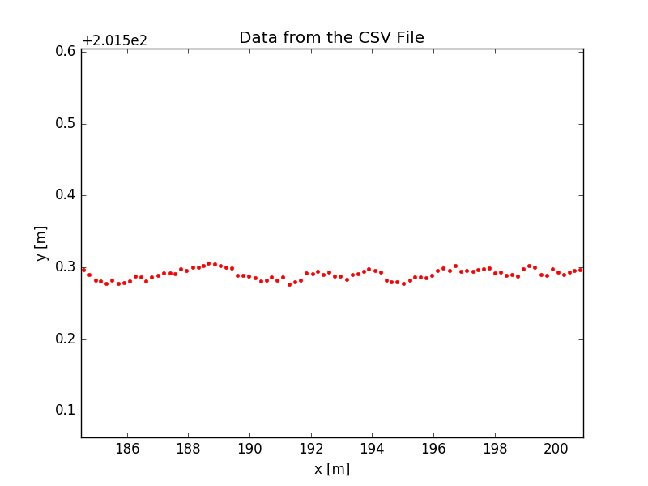

## Waypoints Adjuster

Given the waypoints as in csv file with the 1st two columns representing x and y coordinates, the python script is capable to readjust the waypoints such that the heading and curvature become smoother. 

Details are as follows: 


The original waypoint data used for path following is very rugged, as shown below. It appears the oscillations are a lot. 

| raw waypoints (x, y)              | zoom of waypoints        |
| --------------------------------- | ------------------------ |
|  |  |

A python script `wpProcess.py` is written to preprocess the data. The waypoints are first scattered to evenly distributed with a constant gap (default = 1 m). The program also creates a new csv file to contain the processed result. 

1. The scattered process is done first. The heading angles calculated from these evenly distributed waypoints are also shown (right plot, green dots, ignore )

| evenly scattered waypoints | heading angles                    |
| -------------------------- | --------------------------------- |
|       |  |

2. The curvature values at these evenly distributed waypoints were calcualted and smoothed using a Savitzky-Golay filter. Comparisons before and after applying this filter can be seen below:


3. The steps following is similar to the paper (

   [S. Thrun. Stanley: The Autonomous Car that Won the DARPA challenge]: https://onlinelibrary.wiley.com/doi/abs/10.1002/rob.20147

   ) to further choose and adjust the waypoints' positions. Redistribute the waypoints proportional to the curvature radius calculated in step 2. The algorithm starts from one end, try the initial max length first, if in this range no curvature value exceeds the value matched for this length in the chart below, then take the new point and find the
   next one; otherwise use binary search until it's satisfied. 

   The relationship of the segment length and the curvature radius can be expressed as: 

   *ds* = 0.1\*radius, and limited within \[1, 16\] m

| curvature | radius [m] | *ds* [m] |
| --------- | ---------- | -------- |
| >0.1      | <10        | 1        |
| 0.1       | 10         | 1        |
| 0.05      | 20         | 2        |
| 0.01      | 100        | 10       |
| <1/160    | >160       | 16       |

Updated: The length decision is updated with a greedy algorithm. 

​		The result after applying this redistribution algorithm is shown below with the example. It can be seen that this distribution is more reasonable by putting more waypoints at large curvature to describe the path. 

| redistributed waypoints       | curvature after redistribution  |
| ----------------------------- | ------------------------------- |
|  |  |

​		The length of each segment is printed out as below. It can be seen that the algorithm successfully distribute the waypoint numbers proportional to the curvature radius. And from the curvature plot from the above right plot, it appears appropriate of this re-distribution to better describe curvature and smoothness.

```cmd
ds = 8.0

16.0

16.0

16.0

16.0

8.0

2.0

2.0

1.0

1.0

1.0

1.0

1.0

1.0

1.0

2.0

16.0

8.65849505794 
```

4. Readjust the waypoints' positions from step 3 to reduce the heading changes in between neighboring waypoints. The optimization is used to penalize two items. One is the heading changes between neighboring waypoints. The other is the deviation from orignal waypoints. Results are shown below. See how the heading angles are smoothed through this process. 

| Adjusted waypoionts after optimization | Heading angles after optimization |
| -------------------------------------- | --------------------------------- |
|              |         |

